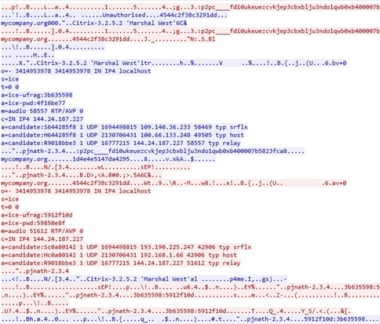

# CVE-2026-XXXXX: Cleartext RTC Signaling and TURN Relay Abuse in Foscam VD1 Doorbell

## Vulnerability Metadata

| Field | Details |
| :--- | :--- |
| **Vendor** | Foscam |
| **Product** | VD1 Video Doorbell |
| **Affected Version** | Versions before V5.3.13_1072 |
| **Component** | RTC Signaling Layer / TURN Client |
| **Attack Type** | Network / Infrastructure Abuse / Privacy |
| **CWE ID** | CWE-319: Cleartext Transmission of Sensitive Information |
| **CVSS 3.1 Vector** | `CVSS:3.1/AV:N/AC:L/PR:N/UI:N/S:U/C:H/I:H/A:L` |
| **Base Score** | 8.3 (High) |

---

## 1. Executive Summary
A critical security flaw was identified in the RTC (Real-Time Communication) implementation of the Foscam Doorbell. The device transmits sensitive Session Description Protocol (SDP), including ICE credentials (`ice-ufrag` and `ice-pwd`), in cleartext over network interfaces. An attacker with network visibility can intercept these credentials to hijack media streams or authenticate to Foscam’s TURN/relay infrastructure to forward arbitrary traffic at the vendor's expense. 

---

## 2. Technical Analysis

### 2.1 Signaling Information Leakage
During the connection phase, the doorbell initiates a handshake where the SDP is sent without TLS encryption or integrity protection. Interception of this traffic reveals:
* **ICE Credentials:** Exposure of `a=ice-ufrag` and `a=ice-pwd`.
* **ICE Candidates:** Cleartext leakage of network routing paths.

### 2.2 TURN Infrastructure Abuse
Because the credentias are sent in the clear, an attacker can use these credentials to authenticate against Foscam’s TURN servers. 
* **Impact:** This allows an attacker to use Foscam's relay servers as a proxy for arbitrary data, leading to financial loss for the vendor (bandwidth costs) and potential legal exposure if the relay is used for malicious activities.

---

## 3. Proof of Concept (PoC)

### 3.1 Interception
1. Monitor the traffic from the doorbell.
2. Capture the outgoing signaling packets.
3. Extract the credentials from the SDP payload.

### 3.2 Relay Verification
1. Use the extracted credentials to attempt a connection to the Foscam TURN server identified in the ICE candidates.
2. Successfully authenticate and relay non-camera traffic through the Foscam infrastructure.

---

## 4. Impact
* **Infrastructure Financial Abuse:** Unauthorized parties can utilize Foscam’s paid relay bandwidth for personal or malicious use.
* **Stream Redirection/Hijacking:** By altering ICE candidates in the cleartext signaling, an attacker can redirect the video feed to an external endpoint.

---

## 5. Recommendations
* **Enforce TLS for Signaling:** All SDP exchanges must be encapsulated in a TLS-encrypted channel (HTTPS/WSS) to protect ICE credentials.
* **Ephemeral TURN Credentials:** Implement the TURN REST API (per RFC 5766) to generate short-lived, session-specific credentials that expire within minutes.

* **Credential Monitoring:** Invalidate any long-term static secrets currently used in the field and monitor TURN logs for anomalous bandwidth usage patterns.

---

## 6. Vendor Response & Remediation:
Upon notification of these vulnerabilities, the Foscam Security Team responded promptly and engaged in a coordinated disclosure process. Foscam has since released a firmware update for the Doorbell and a new version of the accompanying mobile application to address these issues.