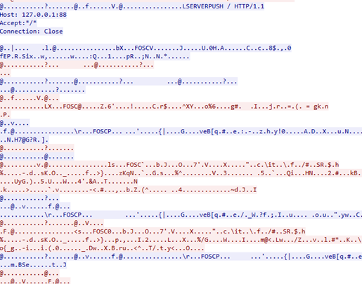

# Security Audit: Foscam 4G Doorbell Ecosystem

---

## 1. Firmware Acquisition & Analysis

### 1.1 Hardware Extraction
Unlike the encrypted firmware available on Foscam's support portals, the physical device contains an unencrypted filesystem on its flash storage. 
* **Method:** Desoldering/clipping the XMC Flash chip.
* **Tool:** CH341A Programmer.
* **Result:** Successfully dumped the full SPI flash image, providing access to the root filesystem.

### 1.2 Decryption Logic
By analyzing the `FirmwareUpdate` binary found on the dumped filesystem, we identified the internal decryption routines used for Foscam's official update packages. The decryption relies on an obfuscated command-line string processed by a function called `ReformatString` inside `libcommonLib.so`.

> **Note:** The underlying firmware decryption strategy for Foscam devices was previously documented by researcher Josh Terrill. Our analysis confirms that the 4G Doorbell series shares this legacy architecture.
> * [Reference: Extracting Firmware & Reverse Engineering Foscam](https://hacked.codes/2023/extracting-firmware-reverse-engineering-encryption-keys-foscam/)

---

## 2. Proprietary Media Encryption Weakness

A primary focus of this research was the analysis of the media transport protocol. While modern WebRTC implementations mandate **DTLS-SRTP** for confidentiality and integrity, Foscam utilizes a proprietary encryption scheme.

### 2.1 The `FOSC` Header
During analysis of media payloads intercepted via TURN relays, we identified repeated 4-byte ASCII markers: `FOSC` (Hex: `46 4F 53 43`). 

The presence of these plaintext markers in the encrypted stream indicates:
* **Lack of AEAD:** The encryption does not provide authenticated data or proper header obfuscation.
* **Weak Cryptographic Design:** The use of a proprietary wrapper instead of industry-standard SRTP facilitates trivial stream reconstruction once the signaling layer is compromised.
* **Pattern Leakage:** The repeated headers allow an attacker to easily identify and frame media packets within a noisy network capture.

---

## 3. Vulnerability Index

| CVE ID | Title | Severity | Impact |
| :--- | :--- | :--- | :--- |
| **[CVE-2026-XXXXX](./CVE-2026-FOSCAM.md)** | Cleartext RTC Signaling & TURN Abuse | 8.3 (High) | Disclosure of signaling, resulting in relay infrastructure abuse and media hijacking. |

---

## 4. Summary of Impact
The combination of cleartext signaling and weak proprietary media encryption results in a total loss of user privacy. Because the signaling leaks the credentials required to access the TURN relay, and the media payloads are protected only by a non-standard `FOSC` wrapper, an attacker can:
1.  **Steal Bandwidth:** Use Foscam's infrastructure to relay unauthorized data.
2.  **Eavesdrop:** Capture and potentially reconstruct live video/audio feeds.
3.  **Impersonate:** Hijack the signaling path to redirect camera streams to malicious endpoints.

---

## 5. Vendor Response & Remediation:
Upon notification of these vulnerabilities, the Foscam Security Team responded promptly and engaged in a coordinated disclosure process. Foscam has since released a firmware update for the Doorbell and a new version of the accompanying mobile application to address these issues.

---

## Research Context & Attribution
This vulnerability was discovered and documented as part of an academic security audit performed at **DistriNet (KU Leuven - Gent)**.

* **Research Group:** [DistriNet](https://distrinet.cs.kuleuven.be/)
* **Institution:** KU Leuven, Faculty of Engineering Technology, Gent Campus.

